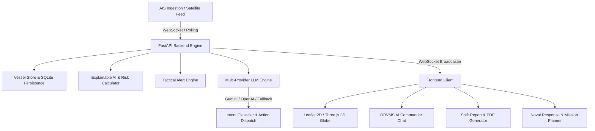

# ⚓ ORVMS — Ocean Risk & Vessel Monitoring System

<!-- Badges -->
[](LICENSE)
[](https://python.org)
[](https://fastapi.tiangolo.com)
[](https://leafletjs.com)
[](https://github.com/sharathkudachi/OCEAN-RISK-VESSEL-MONITORING-SYSTEM-ORVMS-)

**ORVMS (Ocean Risk and Vessel Monitoring System)** is an advanced, production-ready Maritime Situational Awareness and Intelligence Platform. Built for real-time AIS vessel telemetry tracking, EEZ intrusion monitoring, collision risk (CPA/TCPA) calculation, shift intelligence report generation, and multi-provider LLM decision support.

---

## 🌟 Key Features

### 📡 Real-Time Vessel Monitoring & Telemetry
- **Live AIS Ingestion**: Connects to live satellite feeds (`aisstream.io`) or high-fidelity simulated feeds.
- **Marker Clustering & High Performance**: Efficiently renders 10,000+ simultaneous vessel contacts without UI frame drops.
- **Land Guard Clamping**: Automatic spatial detection preventing land-locked vessel coordinates.

### 🛡️ Tactical Risk Assessment & Explainable AI (XAI)
- **Dynamic Threat Classification**: Classifies contacts into `FRIENDLY`, `NEUTRAL`, `UNKNOWN`, `SUSPICIOUS`, and `HIGH_THREAT`.
- **Transparent Factor Breakdown**: Explainable AI breakdowns for loitering, EEZ intrusion, identity spoofing, dark ship behavior, and speed anomalies.
- **EEZ Intrusion Alerts**: Real-time WebSocket alerts triggered upon unauthorized boundary entry.

### 🧠 LLM Tactical Intelligence Advisor (ORVMS AI Commander)
- **Multi-Provider LLM Integration**: Multi-engine support for Google Gemini, OpenAI GPT, Anthropic Claude, OpenRouter, local Ollama, or an offline rule-based fallback.
- **Intent Classification & Scope Enforcement**: Strictly enforces maritime intelligence scope while politely refusing off-topic requests.
- **Stateful Search Sessions**: Context-aware regional query retention (`India`, `Sri Lanka`, `Oman`, `Gulf of Aden`, `Malacca Strait`, `Somali Basin`, `Mediterranean`, `Black Sea`, `Baltic`).
- **Conversational Vessel Registration**: Interactive report log extraction supporting military observation formatting and DMS coordinate parsing (`36°20'N 60°10'W`).

### 📊 Shift Intelligence Reports & Data Import/Export
- **Executive Shift Summary**: One-click generation of Shift Operations reports featuring visual threat level gauges (`LOW`, `MEDIUM`, `HIGH`, `CRITICAL`).
- **PDF & CSV Export**: Export high threat tables, recent alerts, and regional density charts directly to PDF/CSV.
- **Bulk CSV/JSON Import**: Zero-dependency FastAPI endpoint (`/api/vessels/import`) for importing vessel contacts in bulk.

---

## 🏗️ Architecture Overview



---

## 🚀 Quick Start & Local Setup

### 1. Clone Repository
```bash
git clone https://github.com/sharathkudachi/OCEAN-RISK-VESSEL-MONITORING-SYSTEM-ORVMS-.git
cd OCEAN-RISK-VESSEL-MONITORING-SYSTEM-ORVMS-
```

### 2. Environment Configuration
Copy `.env.example` to create your local `.env` configuration file:
```bash
cp .env.example backend/.env
```

Configurable options in `backend/.env`:
```ini
HOST=0.0.0.0
PORT=8000
AIS_PROVIDER=demo       # Options: demo or aisstream
AIS_API_KEY=            # Optional: your aisstream.io key
LLM_PROVIDER=gemini     # Options: gemini, openai, claude, openrouter, ollama, fallback
LLM_API_KEY=your_key    # Optional: LLM API key
LLM_MODEL=gemini-1.5-flash
```

### 3. Install Dependencies & Run Backend
```bash
# Create virtual environment (optional)
python -m venv venv
source venv/bin/activate  # On Windows: venv\Scripts\activate

# Install requirements
pip install -r requirements.txt

# Start backend server
python main.py
```
*Or execute `./start.sh` (Linux/macOS) or `start.bat` (Windows).*

### 4. Access Application
Open your browser and navigate to:
```
http://localhost:8000
```
*The FastAPI backend automatically mounts and serves the single-page frontend application at root.*

---

## 📂 Project Structure

```
orvms/
├── backend/
│   ├── app/
│   │   ├── ai_engine.py       # Explainable Risk Engine & CPA/TCPA calculations
│   │   ├── alerts.py          # Real-time alert generation & WebSocket notification
│   │   ├── api.py             # REST API routes & bulk vessel CSV/JSON imports
│   │   ├── config.py          # Environment configuration loader
│   │   ├── db.py              # Zero-dependency SQLite interface
│   │   ├── llm_engine.py      # LLM reasoning, intent classification & stateful sessions
│   │   ├── models.py          # Pydantic data schemas (Vessel, Alert, Intercept)
│   │   └── store.py           # In-memory thread-safe VesselStore & Land Guard
│   ├── main.py                # FastAPI entry point & Static file mounting
│   └── requirements.txt       # Python backend dependencies
├── frontend/
│   ├── index.html             # Application HTML shell
│   ├── style.css              # Main glassmorphic CSS design system
│   ├── app.js                 # Frontend application bootstrap & Leaflet map engine
│   └── modules/
│       ├── aiAssistant.js     # ORVMS AI Commander interface & action handlers
│       ├── reportGenerator.js # PDF & CSV export engine
│       ├── vesselAnalyticsUI.js # Mission planner & telemetry popups
│       ├── mapEnhancements.js # Map layer switchers & heatmap overlay
│       ├── 3dGlobe/           # Three.js / Globe.gl 3D visualization
│       ├── navalResponse/     # Defense intercept module
│       └── weather/           # Marine meteorological overlay
├── .env.example               # Template environment configuration
├── .gitignore                 # Git ignore rules
├── Dockerfile                 # Docker container definition
├── render.yaml                # Render cloud platform specification
├── start.sh                   # Unix launch script
├── start.bat                  # Windows launch script
└── README.md                  # System documentation
```

---

## 🛠️ Technologies Used

| Layer | Technology |
|-------|-----------|
| **Backend** | Python 3.11+, FastAPI, Uvicorn, Pydantic, WebSockets, SQLite3, HTTPX |
| **LLM Integrations** | Google Gemini, OpenAI GPT, Anthropic Claude, OpenRouter, Ollama |
| **Frontend** | HTML5, Vanilla JavaScript (ES6+), Vanilla CSS (Glassmorphism) |
| **Mapping** | Leaflet.js, Leaflet.markercluster, Three.js, Globe.gl, Chart.js |
